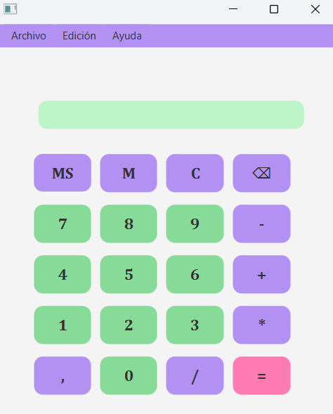
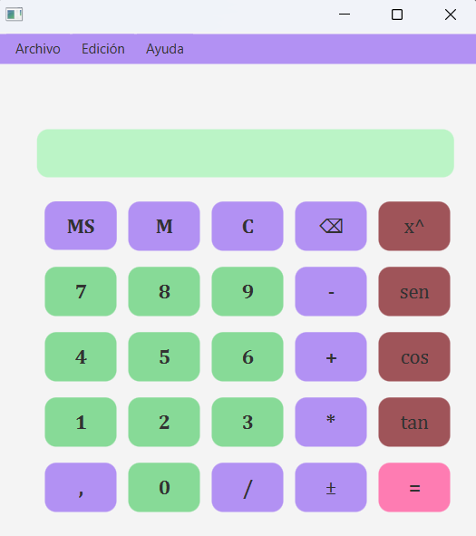
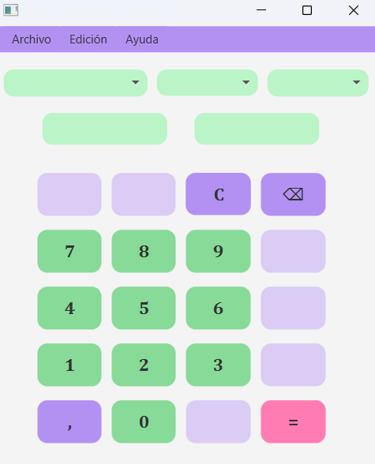
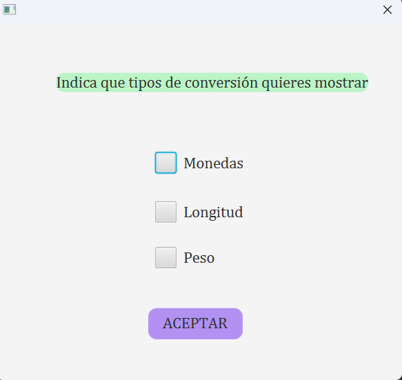

# Proyecto de Calculadora
#Autor: Ronald Vaca
> **Warning**
> El proyecto contiene un archivo **jar**.

## Calculadora Normal

Calculadora Normal es una ventana en la que se pueden realizar operaciones matemáticas básicas 

- Contiene un menu para ir a la calculadora cientifica y a la calculadora de conversiones

 

## Calculadora Científica

**Calculadora científica**
Calculadora Científica es una ventana que realiza operaciones trigonométricas y exponenciales o porcentajes. 
- Contiene un menú superior con dos entradas de *Calculadoras*, *Edición* y *Ayuda*.
- Además cuenta con botones que permiten guardar datos en memoria, y mostrarlos por pantalla.

## Calculadora de Conversiones

Calculadora de conversiones es una ventana que realiza conversiones de Monedas, Longitud y Peso

- Contiene un menú superior con dos entradas de *Calculadoras*, *Edición* y *Ayuda*.
- Contiene 3 *combobox* que muestran el tipo de conversión que deseas realizar, la conversión de origen y de destion.
- Podemos elegir que tipos de *conversiones* mostrar desde una **ventana modal** a la que podremos acceder desde el menú *Edición*.
- La *Conversión de monedas* las realiza mediante una API que proporciona un valor a cada tipo de moneda y devuelve el valor de la moneda que quieres **Convertir**

    
